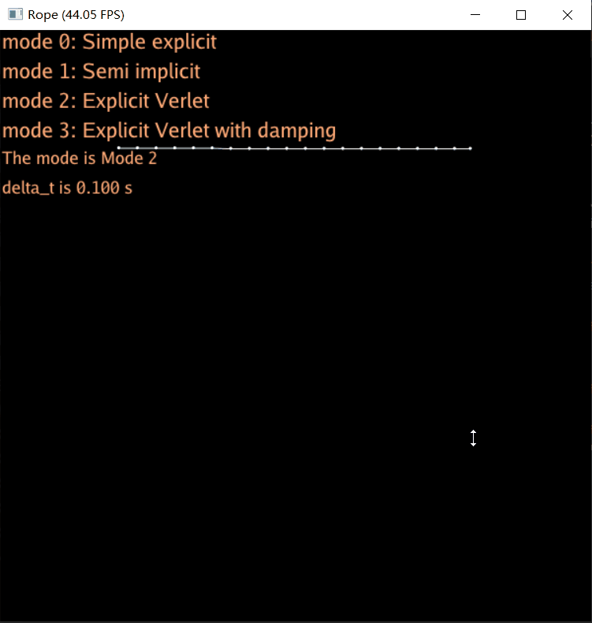
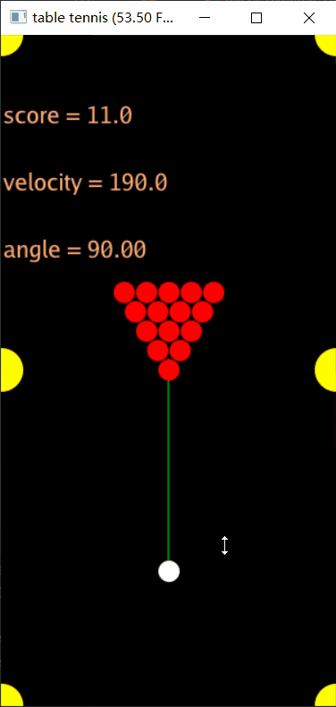

# 太极图形课S1作业
## 背景简介
这里可以简要描述作业（项目）的基本背景情况，它源自哪里？能够有效解决哪些问题？可以尽情列举它的亮点哦

## 成功效果展示
- Games101作业8





- 一个简单的桌球游戏,代码码累了？来打个桌球吧！





- hw4 # reference ==> https://www.shadertoy.com/view/WtScDt#


## 整体结构（Optional）
```
-LICENSE
-|data
-README.MD
-xxx.py
```
